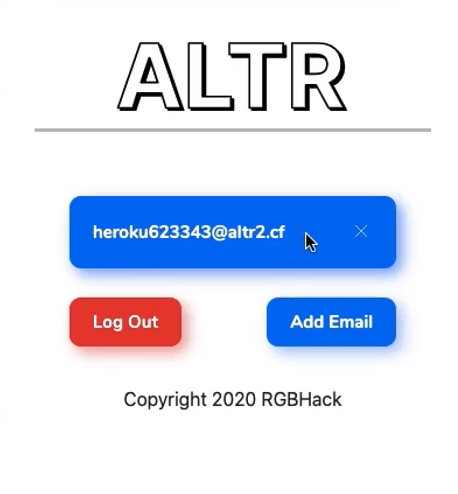

  

<h3 align="center">
  <i>
    A simple and secure way to take control of your email spam
  </i>
</h3>

  
  
  
  
  
  

## ✨ In Action

  

## 🔮 Usage

- Clone this Repository
- Go to chrome://extensions (Chrome) or edge://extensions (Edge)
- On the top right corner (Chrome) or bottom left corner (Edge), enable developer options
- Click on the "Load Unpacked" Option and select the ALTR folder inside the ALTR-ext folder
- You should now see the ALTR extension

## 👨‍💻 Authors

**Aadit Gupta, Rohan Juneja, Raadwan Masum, Safin Singh**

## 🤝 Contributing

Contributions, PRs, issues and feature requests are welcome! Feel free to check out our [issues page](https://github.com/RGBHack/ALTR-Ext/issues).

## ❤️ Show your support

Give a ⭐️ if this project helped you!
Hope you enjoy it!
